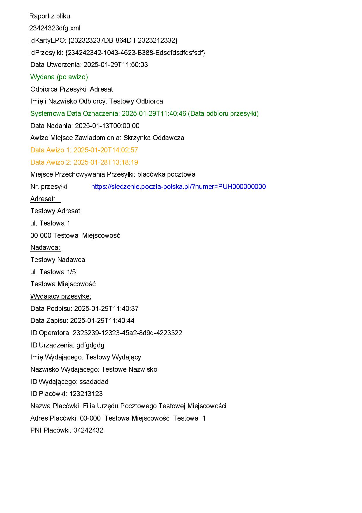
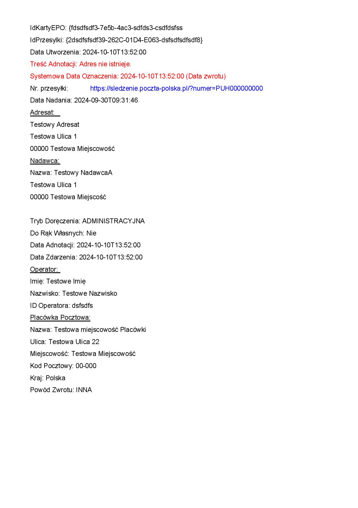
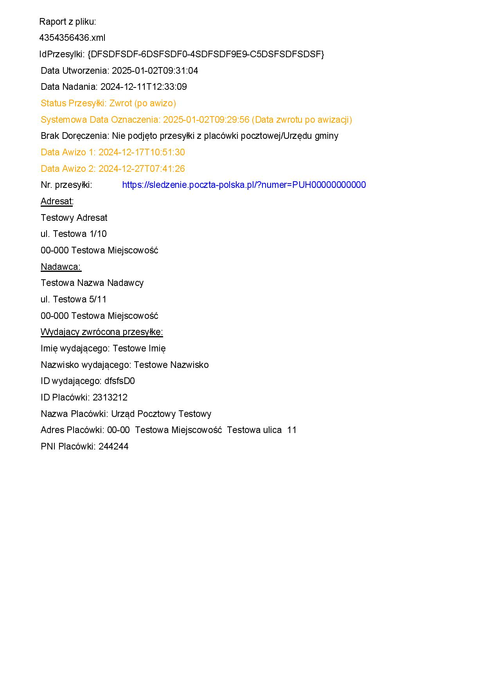

# E-doręczenia wizualizacja potwierdzeń EPO dla przesyłek PUH

## Autor
Tomasz Rekusz

## Opis
Program generuje wizualiację Elektronicznego Potwierdzenia Odbioru (EPO) w formacie xml dla przesyłek Poczty Polskiej (PUH - Publiczna Usługa Hybrydowa).

## Instrukcja
1. Pobierz EPO.exe https://github.com/tomkolp/e-doreczenia-wizualizacja-EPO/releases
2. Umieść i uruchom program w katalogu, gdzie znajdują się pliki XML EPO.
3. Program generuje plik PDF dla nastepujących roadzajów EPO:
   - Doręczenie
   - Odbiór po awizowaniu
   - Zwrot awizowany
   - Zwrot z innych przyczyn
  
# Raport EPO dla przesyłki doręczonej

Poniżej znajdują się zrzuty ekranu dokumentów EPO dla przesyłki.

## 📄 Podgląd dokumentów

### Doręczenie
  
  

📥 **[Pobierz pełny raport PDF](screeny/doreczenie.pdf)**

### Doręczenie po awizo
  
  

📥 **[Pobierz pełny raport PDF](screeny/doreczenie_po_awizo.pdf)**

### Zwrot
  

📥 **[Pobierz pełny raport PDF](screeny/zwrot.pdf)**

### Zwrot awizowany
  

📥 **[Pobierz pełny raport PDF](screeny/zwrot_awizowany.pdf)**

---

📌 **Uwaga:** Wszystkie pliki znajdują się w katalogu `screeny/` w repozytorium.

## Przyszłe Wersje
- Poprawki błędów i optymalizacja

## Wymagania do samodzielnego skompilowania
- Python 3.x

### Wbudowane biblioteki (w zestawie z Pythonem):
- `os`
- `base64`
- `textwrap`
- `xml.etree.ElementTree`
- `io`
- `webbrowser`

### Biblioteki zewnętrzne (instalowane przez PIP):
- `reportlab` (do generowania plików PDF)
- `requests` (do wykonywania żądań HTTP)
- `packaging` (do porównywania wersji)
